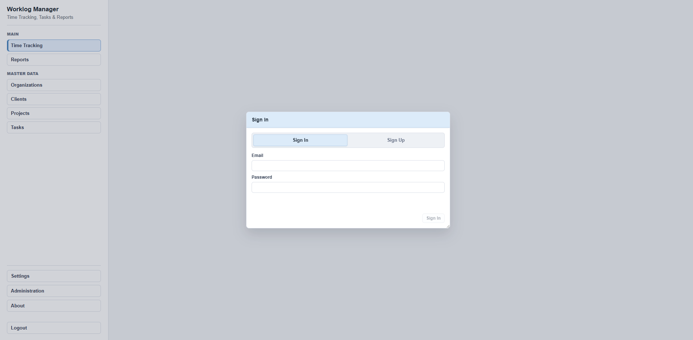
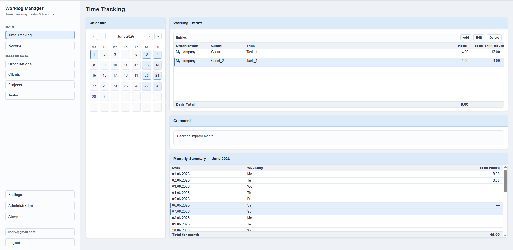
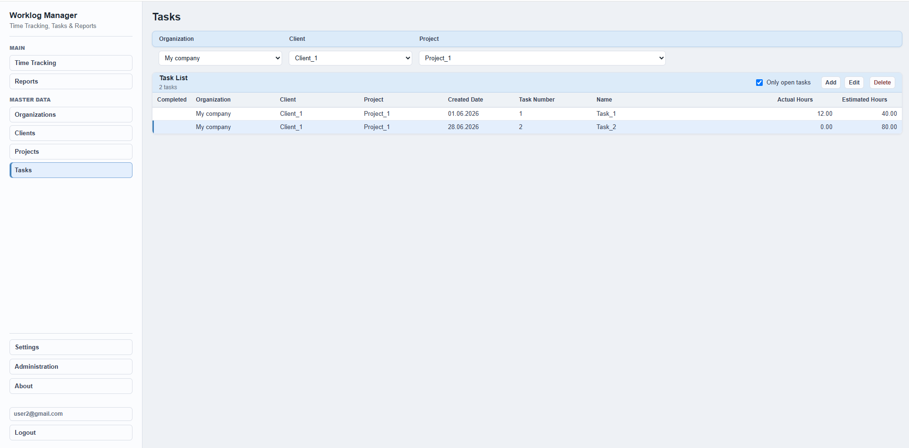
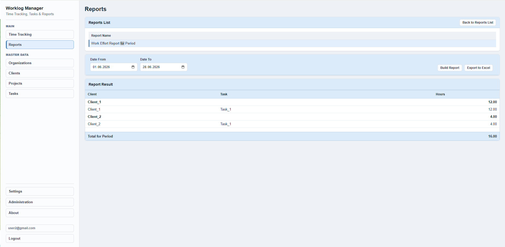
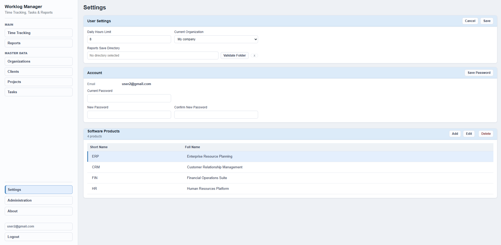
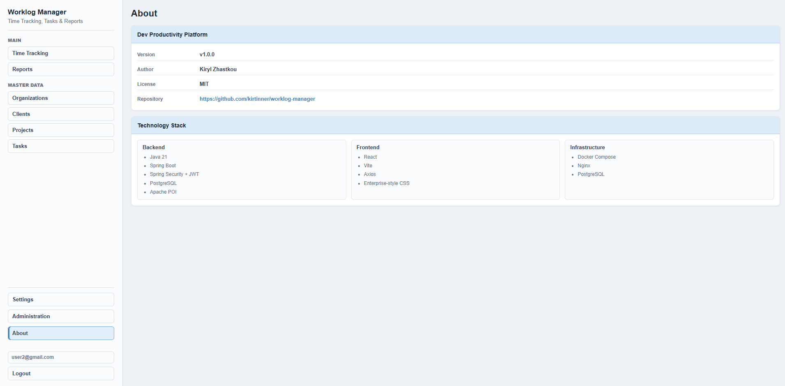

# Dev Productivity Platform


An enterprise-style full-stack productivity platform built with **Java**, **Spring Boot**, **React**, and **PostgreSQL**.

The application provides a complete workspace for managing organizations, clients, projects, tasks, worklogs, reporting, and user settings. It demonstrates a production-oriented layered architecture with secure JWT authentication, multi-user data isolation, Docker-based local deployment, and a compact enterprise-style user interface.

---

# Screenshots

> Replace the placeholder images below with the latest application screenshots.

## Login



## Time Tracking



## Tasks



## Reports



## Settings



## About



---

# Features

## Authentication

- JWT Authentication
- User Registration (Sign Up)
- User Login (Sign In)
- BCrypt password encryption
- Change Password
- User Account information

## Productivity

- Organizations
- Clients
- Projects
- Tasks
- Daily Time Tracking
- Worklog Entries
- Monthly Summaries

## Reporting

- Work Effort Report
- Excel Import
- Excel Export
- Scheduled Export Configuration

## Multi-user

- Complete user data isolation
- User-scoped organizations
- User-scoped clients
- User-scoped projects
- User-scoped tasks
- User-scoped reports
- User-scoped settings

## Application

- About page
- Enterprise-style UI
- Docker support
- REST API
- Production-ready configuration

---

# Technology Stack

## Backend

- Java 21
- Spring Boot
- Spring Security
- JWT Authentication
- Spring Data JPA
- Hibernate
- PostgreSQL
- Apache POI

## Frontend

- React
- Vite
- Axios

## Infrastructure

- Docker
- Docker Compose
- Nginx

---

# Architecture

```text
                React + Vite
                      │
                      ▼
                 Nginx (Frontend)
                      │
                 REST /api
                      │
                      ▼
            Spring Boot REST API
                      │
             Spring Security + JWT
                      │
                      ▼
                 PostgreSQL
```

---

# Quick Start

## Prerequisites

- Docker
- Docker Compose

## Run locally

```bash
docker compose up -d --build
```

Open:

```
http://localhost
```

Create a new account using **Sign Up** and start using the application.

---

# Local Development

## Backend

```bash
cd backend

mvn test

mvn spring-boot:run
```

The backend runs with the **dev** profile by default.

Default database:

```
jdbc:postgresql://localhost:5432/dev_platform
```

---

## Frontend

```bash
cd frontend

npm install

npm run dev
```

The Vite development server proxies `/api` requests to:

```
http://localhost:8080
```

---

# Production Environment Variables

```
DATABASE_URL=jdbc:postgresql://<host>:<port>/<database>
DATABASE_USERNAME=<username>
DATABASE_PASSWORD=<password>

JWT_SECRET=<strong-random-secret>

CORS_ALLOWED_ORIGINS=https://your-domain.com
```

Production recommendations:

- Do not use the **dev** profile.
- Configure a strong `JWT_SECRET`.
- SQL logging is disabled.
- Hibernate schema auto-update is disabled.
- Never commit `.env` files or production credentials.

---

# Docker Services

The local Docker Compose environment starts:

| Service | Port |
|----------|------|
| PostgreSQL | 5432 |
| Spring Boot Backend | 8080 |
| React + Nginx Frontend | 80 |

---

# Project Structure

```text
backend/
    Spring Boot REST API

frontend/
    React + Vite application

docs/
    Screenshots

docker-compose.yml
    Local development environment

README.md
```

---

# Roadmap

## Version 1.1

- Email Verification
- Forgot Password
- User Profile

## Version 1.2

- Role Management
- Additional Reports
- Dashboard Improvements

## Future

- Flyway/Liquibase
- Additional Integration Tests
- Team Collaboration

---

# Current Version

**v1.0.0**

---

# License

This project is licensed under the MIT License.

See the **LICENSE** file for details.