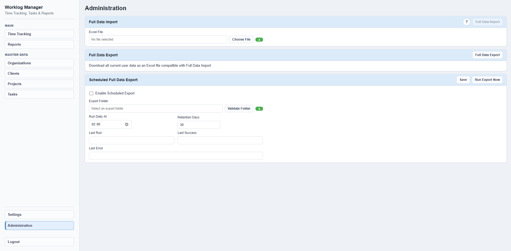

# Worklog Manager


## Project Overview

Worklog Manager is a full-stack productivity and time tracking application for software developers and small teams.

It provides a practical workspace for managing organizations, clients, projects, tasks, daily worklog entries, and effort reports. The project also includes Excel-based import/export workflows, scheduled export configuration, JWT-based authentication, and Docker Compose support for running the full local stack.

The application is built as a Spring Boot REST API, a React/Vite frontend, and a PostgreSQL database. It is intended as an enterprise-style pet project that demonstrates common full-stack application patterns without adding unnecessary infrastructure complexity.

## Screenshots

### Login


### Time Tracking


### Reports


### Administration



## Features

### Organizations Management

Create, edit, select, and delete organizations used as the top-level scope for clients, projects, tasks, and worklog entries.

### Clients Management

Manage clients within organizations, including visibility settings used by the worklog and task management workflows.

### Projects Management

Create and maintain projects linked to organizations and clients. Projects can be marked as completed and filtered in the UI.

### Tasks Management

Manage development tasks with project, client, organization, software product, estimates, completion status, task links, and comments. Task details include related worklog entries.

### Time Tracking

Track daily worklog entries by organization, client, task, date, hours, and comments. The UI includes daily and monthly summaries.

### Reports

Generate work effort reports for selected date ranges and review totals grouped by client and task.

### Full Data Import

Import full application data from Excel files using the administration page. The application validates import files before applying data.

### Full Data Export

Export full application data to Excel for backup or migration purposes.

### Scheduled Full Data Export

Configure scheduled full data exports, including export folder, run time, retention period, and manual run-now execution.

### Docker Deployment

Run PostgreSQL, the Spring Boot backend, and the React/Vite frontend served through Nginx using Docker Compose.

## Technology Stack

### Backend

- Java 21
- Spring Boot
- Spring Security
- JWT Authentication
- Spring Data JPA
- PostgreSQL

### Frontend

- React
- Vite
- Axios

### Infrastructure

- Docker
- Docker Compose
- Nginx

## Architecture

```text
Browser
  ↓
Nginx / React UI
  ↓
Spring Boot REST API
  ↓
PostgreSQL
```

## Quick Start

### Prerequisites

- Docker
- Docker Compose

### Run The Application

From the project root:

```bash
docker compose up -d --build
```

Open the application:

```text
http://localhost
```

The first startup on an empty database creates a demo user and sample data automatically.

## Demo Login

```text
Email: example@gmail.com
Password: 123
```

## Services

Docker Compose starts three services:

- `postgres` - PostgreSQL database on port `5432`
- `backend` - Spring Boot API on port `8080`
- `frontend` - Nginx-served React application on port `80`

The frontend proxies `/api/` requests to the backend service through Nginx.

## Configuration

The backend uses local development defaults from `backend/src/main/resources/application.yml`.

For Docker Compose, datasource settings are provided through environment variables:

```yaml
SPRING_DATASOURCE_URL=jdbc:postgresql://postgres:5432/dev_platform
SPRING_DATASOURCE_USERNAME=postgres
SPRING_DATASOURCE_PASSWORD=postgres
```

JWT tokens are signed with the `JWT_SECRET` environment variable. If it is not provided, the application uses a demo default suitable for local development:

```yaml
JWT_SECRET=my-super-secret-key-my-super-secret-key
```

For non-demo deployments, set a strong custom `JWT_SECRET`.

## Security Notes

- `JWT_SECRET` can be provided through an environment variable.
- If `JWT_SECRET` is not set, the backend falls back to the demo default from `application.yml`.
- The default JWT secret is suitable only for local/demo usage.
- Do not publish real `.env` files, database dumps, Excel exports, backup files, or local machine paths.

## Project Structure

```text
.
+-- backend/              # Java Spring Boot backend
+-- frontend/             # React + Vite frontend
+-- docker-compose.yml    # PostgreSQL, backend, frontend stack
+-- README.md
```

## Local Development

### Backend

```bash
cd backend
mvn test
mvn spring-boot:run
```

By default, the backend expects PostgreSQL at:

```text
jdbc:postgresql://localhost:5432/dev_platform
```

### Frontend

```bash
cd frontend
npm install
npm run dev
```

The Vite dev server proxies `/api` requests to `http://localhost:8080`.

## Useful Commands

Build and start all services:

```bash
docker compose up -d --build
```

View running containers:

```bash
docker compose ps
```

View logs:

```bash
docker compose logs -f
```

Stop services:

```bash
docker compose down
```

Stop services and remove the database volume:

```bash
docker compose down -v
```

## Future Improvements

- Multi-user support
- Cloud backup
- Advanced reporting
- Notifications
- More granular roles and permissions

## License

This project is licensed under the MIT License. See [LICENSE](LICENSE).
